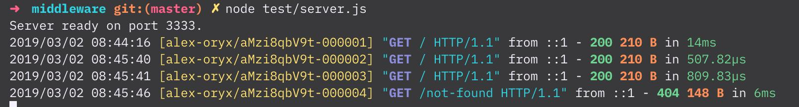

# Middleware

A collection of express/connect middleware.

## Exports

- `RequestId`: Class for adding request ids.
- `RequestLog`: Class for logging requests.
- `RequestLogOptions`: [TypeScript] Configuration parameters for the RequestLog middleware.

### `RequestId`

A class to uniquely id incoming requests. Use the inject middleware at the beginning of your stack.

```ts
import express from "express";
import { RequestId } from "@alexsasharegan/middleware";

const app = express();
// This middleware injects a request id in both the request/response objects.
// It does not set any headers.
app.use(RequestId.injectMiddleware);
// This sets the request id on the response header.
app.use(RequestId.setHeaderMiddleware);
// This is the default header name used. Customize it to use a different name.
RequestId.headerName = "X-Request-ID";
```

If you need to make use of the id for something like writing it in response headers, an extract method is available:

```ts
app.get("/", function(req, res) {
	// You can extract from either the request/response.
	let requestId = RequestId.extract(req);
	res.setHeader("X-Request-ID", requestId.toString());
	res.end();
});
```

### `RequestLog`

A class to log requests. Call the middleware function to configure a middleware handler. Place is at the beginning of
your stack.

```ts
import express from "express";
import { RequestId, RequestLog } from "@alexsasharegan/middleware";

const app = express();

// Set up the request id injector to enable request ids in the logs.
app.use(RequestId.injectMiddleware);
app.use(RequestId.setHeaderMiddleware);

// Make sure to place this after the request id middleware,
// but at the beginning of the middleware chain to get accurate timing.
app.use(
	RequestLog.middleware({
		withColors: true, // tty color output
		newLine: RequestLog.NewLine.LF, // Linux/Mac style new line.
		stream: process.stderr, // log to any stream
	})
);
```



```sh
$ curl -I localhost:3333

HTTP/1.1 200 OK
X-Powered-By: Express
X-Request-ID: alex-oryx/aMzi8qbV9t-000003
Content-Type: text/html; charset=utf-8
Content-Length: 210
ETag: W/"d2-GN0jX1nIvHaoCqXqmz8Mk80JF74"
Date: Sat, 02 Mar 2019 15:50:53 GMT
Connection: keep-alive
```
